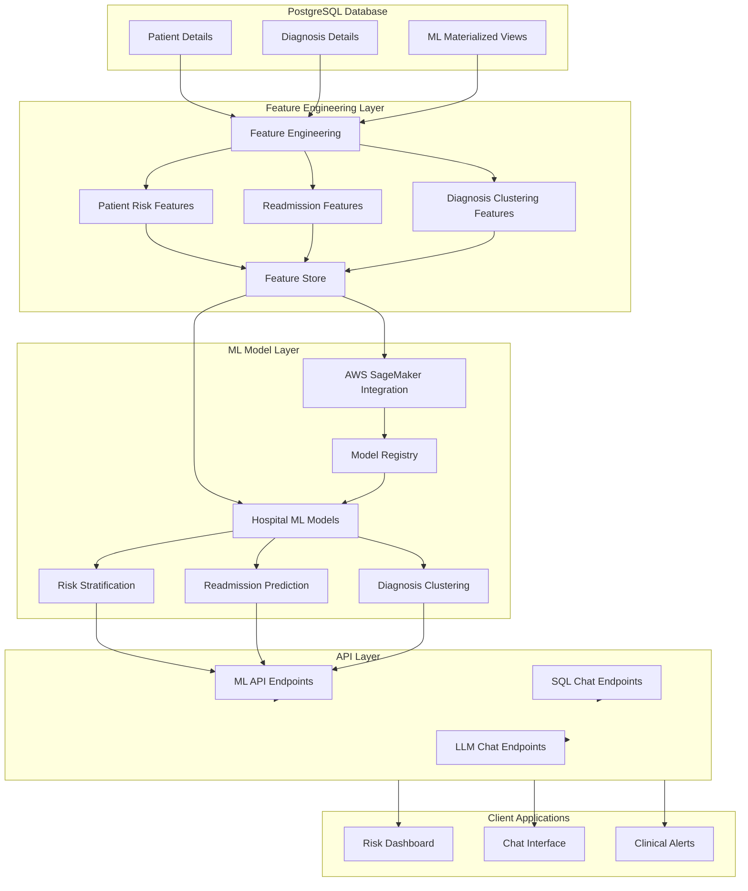

# Hospital Data Chatbot: Machine Learning Implementation Guide

This guide outlines how to enhance your Hospital Data Chatbot with machine learning capabilities, leveraging your PostgreSQL database and AWS services.

## Architecture Overview

The following diagram illustrates the machine learning architecture that we're implementing:



### Key Components

1. **Data Extraction Layer**
   - Extract features from PostgreSQL database
   - Transform raw data into ML-ready features
   - Store features for reuse
   
2. **Model Training & Hosting Layer**
   - Train models with AWS SageMaker
   - Deploy models as endpoints
   - Manage model versions
   
3. **API Integration Layer**
   - Expose ML predictions via API
   - Integrate with chatbot interface
   - Provide analytics endpoints

## Implementation Steps

### 1. Set Up AWS SageMaker Role

First, create an IAM role for SageMaker with the necessary permissions:

```bash
aws iam create-role --role-name HospitalSageMakerRole \
  --assume-role-policy-document file://sagemaker-trust-policy.json

aws iam attach-role-policy --role-name HospitalSageMakerRole \
  --policy-arn arn:aws:iam::aws:policy/AmazonSageMakerFullAccess

aws iam attach-role-policy --role-name HospitalSageMakerRole \
  --policy-arn arn:aws:iam::aws:policy/AmazonS3FullAccess
```

Add the role ARN to your configuration:

```python
# app/config/settings.py
SAGEMAKER_ROLE_ARN = "arn:aws:iam::YOUR_ACCOUNT_ID:role/HospitalSageMakerRole"
```

### 2. Install Required Dependencies

Add the required dependencies to your `pyproject.toml` file:

```toml
[project.dependencies]
# Existing dependencies...
pandas = "^2.0.0"
scikit-learn = "^1.2.0"
sagemaker = "^2.132.0"
```

Install the dependencies:

```bash
uv pip install -e ".[ml]"
```

### 3. Create Feature Engineering Pipeline

Implement the feature engineering module as shown in the code examples. This involves:

1. **Feature Extraction**: Pull relevant data from PostgreSQL
2. **Feature Transformation**: Convert raw data into ML-ready features
3. **Feature Storage**: Cache features for efficiency

The code provided in `app/ml/feature_engineering.py` implements these capabilities.

### 4. Set Up SageMaker Integration

The `app/ml/sagemaker_integration.py` module provides:

1. **Model Training**: Train ML models with SageMaker
2. **Model Deployment**: Deploy models to endpoints
3. **Inference**: Get predictions from deployed models

### 5. Implement ML Models

In `app/ml/hospital_ml_models.py`, we've implemented:

1. **Readmission Risk Prediction**: Predict 30-day readmission risk
2. **Patient Risk Stratification**: Classify patients by risk level
3. **Diagnosis Clustering**: Group similar diagnoses

### 6. Add API Endpoints

The `app/api/ml_routes.py` module exposes these ML capabilities through REST endpoints:

- `/api/ml/patient-risk` - Get risk stratification for patients
- `/api/ml/readmission-risk/{patient_id}` - Get readmission risk for a patient
- `/api/ml/diagnosis-clusters` - Get clusters of similar diagnoses
- `/api/ml/train-model` - Train a new ML model (dev/staging only)
- `/api/ml/deploy-model` - Deploy a trained model (dev/staging only)

### 7. Database Considerations for ML

To optimize your PostgreSQL database for machine learning:

#### 7.1. Create Materialized Views for Feature Sets

```sql
CREATE MATERIALIZED VIEW ml_patient_features AS
SELECT 
    p.registry_id,
    p.age,
    p.gender,
    p.stay_duration,
    COUNT(d.id) AS diagnosis_count,
    MAX(CASE WHEN d.diagnosis ILIKE '%diabetes%' THEN 1 ELSE 0 END) AS has_diabetes,
    MAX(CASE WHEN d.diagnosis ILIKE '%hypertension%' THEN 1 ELSE 0 END) AS has_hypertension,
    MAX(CASE WHEN d.diagnosis ILIKE '%heart%' THEN 1 ELSE 0 END) AS has_heart_condition,
    MAX(CASE WHEN d.diagnosis ILIKE '%kidney%' THEN 1 ELSE 0 END) AS has_kidney_condition,
    MAX(CASE WHEN d.diagnosis ILIKE '%liver%' THEN 1 ELSE 0 END) AS has_liver_condition
FROM 
    patient_details p
LEFT JOIN 
    diagnosis_details d ON p.registry_id = d.registry_id
GROUP BY 
    p.registry_id, p.age, p.gender, p.stay_duration;

-- Create index for faster lookups
CREATE INDEX ON ml_patient_features (registry_id);
```

#### 7.2. Set Up Regular View Refreshes

Create a function to refresh the materialized views:

```sql
CREATE OR REPLACE FUNCTION refresh_ml_views() RETURNS void AS $$
BEGIN
    REFRESH MATERIALIZED VIEW CONCURRENTLY ml_patient_features;
    -- Add more views as needed
END;
$$ LANGUAGE plpgsql;
```

Schedule this to run regularly:

```bash
# Add to crontab
0 2 * * * psql -c "SELECT refresh_ml_views();" -d hospital_data_test
```

#### 7.3. Optimize Query Performance

Add indexes on commonly queried columns:

```sql
CREATE INDEX ON patient_details (age);
CREATE INDEX ON patient_details (gender);
CREATE INDEX ON diagnosis_details (diagnosis);
CREATE INDEX ON diagnosis_details (registry_id);
```

Consider partitioning large tables:

```sql
-- Example: Partition patient_details by age ranges
CREATE TABLE patient_details (
    registry_id TEXT PRIMARY KEY,
    age INTEGER,
    gender TEXT,
    -- other columns
) PARTITION BY RANGE (age);

CREATE TABLE patient_details_young PARTITION OF patient_details
    FOR VALUES FROM (0) TO (40);

CREATE TABLE patient_details_middle PARTITION OF patient_details
    FOR VALUES FROM (40) TO (65);

CREATE TABLE patient_details_elderly PARTITION OF patient_details
    FOR VALUES FROM (65) TO (MAXVALUE);
```

### 8. ML Model Types for Hospital Data

Here are some effective ML models for hospital data analysis:

#### 8.1. Readmission Prediction
- **Model Type**: XGBoost or Logistic Regression
- **Features**: Demographics, diagnoses, comorbidities, length of stay
- **Target**: Binary (readmitted within 30 days or not)
- **Evaluation**: AUC-ROC, precision, recall

#### 8.2. Length of Stay Prediction
- **Model Type**: Random Forest or Gradient Boosting Regressor
- **Features**: Demographics, admission type, diagnoses
- **Target**: Continuous (number of days)
- **Evaluation**: RMSE, MAE

#### 8.3. Diagnosis Clustering
- **Model Type**: K-Means or Hierarchical Clustering
- **Features**: Co-occurring conditions, patient demographics, outcomes
- **Approach**: Unsupervised learning
- **Evaluation**: Silhouette score, domain expert validation

#### 8.4. Mortality Risk Scoring
- **Model Type**: Gradient Boosting Classifier
- **Features**: Age, vital signs, lab values, comorbidities
- **Target**: Binary (mortality outcome)
- **Evaluation**: AUC-ROC, calibration plots

### 9. Integration with Text-to-SQL Feature

To combine ML capabilities with your text-to-SQL feature:

#### 9.1. Enhance the SQL Query Engine

Update your SQL query engine to recognize ML-related queries:

```python
def _generate_sql_prompt(self, user_query: str) -> str:
    # Existing prompt code...
    
    # Add ML capabilities information
    ml_capabilities = """
    This database also has machine learning capabilities, including:
    1. Patient risk stratification: ml_patient_features table
    2. Readmission prediction: ml_readmission_prediction table
    3. Diagnosis clustering: ml_diagnosis_clusters table
    
    If the user is asking for predictions, risk assessments, or pattern analysis,
    consider including these ML-derived tables in your query.
    """
    
    prompt += ml_capabilities
    return prompt
```

#### 9.2. Create a Hybrid Response Function

```python
def process_ml_enhanced_query(self, user_query: str) -> Dict[str, Any]:
    """Process a query that might need both SQL and ML capabilities."""
    # Check if query seems ML-related
    ml_keywords = ["predict", "risk", "likelihood", "similar", "pattern", 
                  "cluster", "group", "readmission", "mortality"]
    
    is_ml_query = any(keyword in user_query.lower() for keyword in ml_keywords)
    
    # Get SQL response
    sql_response = self.process_query(user_query)
    
    # For ML-related queries, enhance with ML predictions
    if is_ml_query:
        # Initialize ML models if needed
        if not hasattr(self, "ml_models"):
            from app.ml.hospital_ml_models import HospitalMLModels
            self.ml_models = HospitalMLModels()
        
        # Extract entities from the query (e.g., patient IDs)
        # This is a simplification - in practice, use NLP to extract entities
        patient_id_match = re.search(r"patient\s+(\w+)", user_query, re.IGNORECASE)
        patient_id = patient_id_match.group(1) if patient_id_match else None
        
        # Get relevant ML predictions
        ml_data = {}
        if patient_id and "readmission" in user_query.lower():
            ml_data["readmission_risk"] = self.ml_models.get_readmission_risk(patient_id)
        elif "risk" in user_query.lower():
            ml_data["patient_risk"] = self.ml_models.get_patient_risk_stratification(patient_id)
        elif any(word in user_query.lower() for word in ["similar", "pattern", "cluster"]):
            ml_data["diagnosis_clusters"] = self.ml_models.get_diagnosis_clusters()
        
        # Combine SQL results with ML predictions for final response
        combined_response = self._format_hybrid_response(user_query, sql_response, ml_data)
        return combined_response
    
    # For non-ML queries, just return the SQL response
    return sql_response
```

### 10. Performance Considerations

#### 10.1. Feature Store Optimization

Use a feature store to avoid recomputing features:

```python
# Pseudocode for feature store optimization
def get_feature(feature_name, entity_id, force_refresh=False):
    cache_key = f"{feature_name}_{entity_id}"
    
    # Check if in cache and not expired
    if not force_refresh and cache_exists(cache_key) and not cache_expired(cache_key):
        return get_from_cache(cache_key)
    
    # Otherwise compute and store
    feature_value = compute_feature(feature_name, entity_id)
    store_in_cache(cache_key, feature_value)
    return feature_value
```

#### 10.2. Batch Predictions

Implement batch prediction for efficiency:

```python
def batch_predict_readmission_risk(patient_ids):
    """Run predictions for multiple patients in one batch."""
    # Get features for all patients
    features_list = []
    for patient_id in patient_ids:
        features = get_patient_features(patient_id)
        features_list.append(features)
    
    # Create a batch
    batch = create_prediction_batch(features_list)
    
    # Make a single call to the SageMaker endpoint
    batch_predictions = invoke_endpoint_with_batch(batch)
    
    # Map predictions back to patient IDs
    results = {}
    for i, patient_id in enumerate(patient_ids):
        results[patient_id] = batch_predictions[i]
    
    return results
```

#### 10.3. Caching Strategy

Implement a multi-level caching strategy:

```python
def get_ml_prediction(patient_id, prediction_type):
    """Get ML prediction with caching."""
    cache_key = f"{prediction_type}_{patient_id}"
    
    # Try memory cache first (fastest)
    if cache_key in memory_cache:
        return memory_cache[cache_key]
    
    # Try disk cache next
    if os.path.exists(f"cache/{cache_key}.json"):
        with open(f"cache/{cache_key}.json", "r") as f:
            prediction = json.load(f)
            # Store in memory for next time
            memory_cache[cache_key] = prediction
            return prediction
    
    # If not in cache, compute prediction
    prediction = compute_prediction(patient_id, prediction_type)
    
    # Store in both caches
    memory_cache[cache_key] = prediction
    with open(f"cache/{cache_key}.json", "w") as f:
        json.dump(prediction, f)
    
    return prediction
```

### 11. Monitoring and Evaluation

#### 11.1. Model Performance Tracking

Create a model performance tracking system:

```python
def track_model_performance(model_id, prediction, actual_outcome):
    """Track model prediction performance over time."""
    # Store the prediction and outcome
    db.execute("""
        INSERT INTO model_performance_tracking
        (model_id, prediction_time, prediction, actual_outcome)
        VALUES (%s, %s, %s, %s)
    """, (model_id, datetime.now(), prediction, actual_outcome))
    
    # Update aggregate metrics
    update_model_metrics(model_id)
```

#### 11.2. Model Drift Detection

Implement model drift detection:

```python
def check_model_drift(model_id, window_days=30):
    """Check if model performance is drifting."""
    # Get recent performance
    recent_performance = db.query("""
        SELECT AVG(CASE WHEN prediction = actual_outcome THEN 1 ELSE 0 END) as accuracy
        FROM model_performance_tracking
        WHERE model_id = %s AND prediction_time > NOW() - INTERVAL '%s days'
    """, (model_id, window_days))
    
    # Get baseline performance
    baseline_performance = get_model_baseline(model_id)
    
    # Calculate drift
    drift_amount = baseline_performance - recent_performance
    
    # Alert if significant drift
    if drift_amount > 0.05:  # 5% threshold
        send_alert(f"Model {model_id} has drifted by {drift_amount:.2%}")
        
    return drift_amount
```

### 12. Real-World Examples

#### 12.1. Patient Risk Dashboard

Use the ML endpoints to create a dashboard:

```javascript
// Frontend pseudocode
async function loadPatientRiskDashboard() {
  // Get population risk distribution
  const riskData = await fetch('/api/ml/patient-risk').then(r => r.json());
  
  // Create distribution chart
  createChart('risk-distribution', riskData.risk_distribution);
  
  // Highlight high-risk patients
  const highRiskPatients = await fetch('/api/db/sql-chat', {
    method: 'POST',
    body: JSON.stringify({
      query: "Which patients are at high risk of readmission?",
      include_sql: true
    })
  }).then(r => r.json());
  
  // Populate high-risk table
  populateTable('high-risk-table', highRiskPatients.data);
}
```

#### 12.2. Readmission Prevention Workflow

```python
# Backend pseudocode
def readmission_prevention_workflow():
    """Run daily to identify patients for intervention."""
    # Get discharged patients from last 7 days
    recent_patients = db.query("""
        SELECT registry_id FROM patient_details
        WHERE discharge_date BETWEEN NOW() - INTERVAL '7 days' AND NOW()
    """)
    
    # Predict readmission risk for each
    high_risk_patients = []
    for patient in recent_patients:
        risk = ml_models.get_readmission_risk(patient.registry_id)
        if risk.get('risk_level') == 'High':
            high_risk_patients.append({
                'patient_id': patient.registry_id,
                'risk_score': risk.get('risk_score'),
                'key_factors': risk.get('key_factors')
            })
    
    # Generate intervention list
    if high_risk_patients:
        generate_intervention_report(high_risk_patients)
        
    return high_risk_patients
```

## Next Steps

After implementing the base ML functionality:

1. **Model Refinement**: Tune hyperparameters and add more features
2. **A/B Testing**: Compare different model versions
3. **Scheduled Retraining**: Set up regular model retraining
4. **Feedback Loop**: Capture outcomes to improve future predictions
5. **Advanced Features**: Add time-series prediction and patient similarity analysis

This implementation guide provides a comprehensive foundation for adding machine learning capabilities to your hospital data chatbot. By following these steps, you'll enable data-driven insights and predictions from your PostgreSQL database.