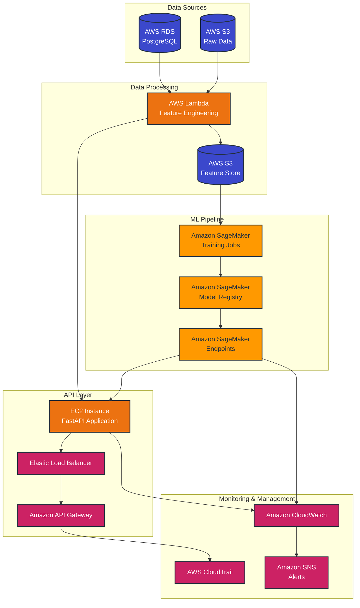

# 🏥 Hospital Data Chatbot

> An AI-powered chatbot for analyzing hospital patient data using AWS Bedrock, Text-to-SQL, and Machine Learning


## 📋 Overview

This application provides an intelligent chatbot interface for hospital staff to query patient and diagnosis data through natural language. It uses AWS Bedrock Large Language Models to interpret queries, converts them to SQL, and leverages machine learning models to provide advanced insights and predictions.

### Key Features

- 🔍 **Natural Language to SQL**: Convert plain language questions into precise SQL queries
- 🧠 **Machine Learning Insights**: Predictive analytics for patient risk and outcomes
- 📊 **Statistical Analysis**: Accurate calculations on patient metrics and trends
- 🧹 **Advanced Data Processing**: Data sanitization and feature engineering pipelines
- 🔄 **Automated Data Pipeline**: Scheduled processing for up-to-date insights
- 📝 **PostgreSQL Integration**: Direct querying of hospital database with proper relationships
- 🚀 **AWS Integration**: Leverages AWS Bedrock, SageMaker, Lambda, and other services

## 🏗️ Architecture



## ✨ Advanced Capabilities

### Text-to-SQL Translation

Our application uses AWS Bedrock to intelligently translate natural language questions into SQL queries:

1. **Query Understanding**: Analyzes intent and context of natural language questions
2. **Schema-Aware Translation**: Generates SQL based on hospital database schema
3. **SQL Validation**: Ensures queries are safe and optimized before execution
4. **Result Formatting**: Presents results in an easy-to-understand natural language format

Example query:
```
"How many patients over 65 were diagnosed with pneumonia last month?"
```

### Machine Learning Predictions

The system provides several ML-powered insights:

1. **Patient Risk Stratification**: Classifies patients by risk level using demographic and clinical factors
2. **Readmission Prediction**: Identifies patients at risk of 30-day readmission
3. **Diagnosis Clustering**: Groups similar diagnoses to uncover patterns
4. **Length of Stay Prediction**: Forecasts expected hospital stay duration

All models are trained using Amazon SageMaker and served through SageMaker endpoints.

## 🚀 Getting Started

### Setup with uv (Recommended)

#### Unix/MacOS
```bash
./setup_uv.sh
```

### Traditional Setup

```bash
# Create virtual environment
python -m venv venv
source venv/bin/activate  # On Windows: venv\Scripts\activate

# Install dependencies
pip install -r requirements.txt

# Run locally for testing
python -m app.main
```

## 🧪 Local Testing

### Prerequisites

1. Install a local PostgreSQL instance or use Docker:
   ```bash
   docker run --name postgres-test -e POSTGRES_PASSWORD=postgres -e POSTGRES_DB=hospital_data_test -p 5432:5432 -d postgres:14
   ```

2. Create a `.env` file in project root:
   ```
   DEBUG=True
   PORT=8080
   DATA_DIR=data
   DB_HOST=localhost
   DB_PORT=5432
   DB_NAME=hospital_data_test
   DB_USER=postgres
   DB_PASSWORD=postgres
   USE_S3=False
   ```

3. Prepare test data:
   ```bash
   mkdir -p data/raw
   cp path/to/your/hospital_data.xlsx data/raw/
   ```

4. Launch the API:
   ```bash
   uvicorn app.main:app --reload --host 0.0.0.0 --port 8080
   ```

5. Access the API documentation:
   - http://localhost:8080/docs

## 📚 API Endpoints

### Text-to-SQL Interface

```
POST /api/db/sql-chat
```

Request body:
```json
{
  "query": "How many male patients with diabetes were admitted last year?",
  "include_sql": true,
  "include_reasoning": false
}
```

### ML Prediction Endpoints

```
GET /api/ml/patient-risk?patient_id=P12345
GET /api/ml/readmission-risk/P12345
GET /api/ml/diagnosis-clusters
```

### Core Endpoints

```
GET /api/health
GET /api/data/stats
POST /api/chat
POST /api/import-to-db
```

## 🌩️ AWS Deployment

```bash
# Build Docker image
docker build -t hospital-chatbot:latest .

# Push to ECR
aws ecr get-login-password | docker login --username AWS --password-stdin $AWS_ACCOUNT_ID.dkr.ecr.$AWS_REGION.amazonaws.com
docker tag hospital-chatbot:latest $AWS_ACCOUNT_ID.dkr.ecr.$AWS_REGION.amazonaws.com/hospital-chatbot:latest
docker push $AWS_ACCOUNT_ID.dkr.ecr.$AWS_REGION.amazonaws.com/hospital-chatbot:latest

# Deploy CloudFormation stack
aws cloudformation deploy \
  --template-file deploy/cloudformation.yaml \
  --stack-name hospital-chatbot \
  --parameter-overrides Environment=dev ModelId=anthropic.claude-3-sonnet-20240229-v1:0 \
  --capabilities CAPABILITY_IAM
```

## 🔒 Security Features

- ✅ **SQL Injection Prevention**: All SQL queries are validated and sanitized
- ✅ **Input Validation**: Comprehensive data validation at all entry points
- ✅ **IAM Role-Based Access**: Fine-grained AWS permissions
- ✅ **Data Encryption**: Hospital data encrypted at rest and in transit
- ✅ **API Key Authentication**: Secure API access with key validation

## 📂 Project Structure

```
hospital-data-chatbot/
│
├── app/                         # Application code
│   ├── api/                     # API endpoints
│   │   ├── routes.py            # Main API routes
│   │   ├── sql_chat_routes.py   # Text-to-SQL endpoints
│   │   └── ml_routes.py         # Machine learning endpoints
│   ├── config/                  # Configuration
│   ├── core/                    # Core logic
│   │   ├── data_processor.py    # Data processing and sanitization
│   │   ├── sql_query_engine.py  # Text-to-SQL engine
│   │   └── llm_connector.py     # AWS Bedrock LLM interface
│   ├── ml/                      # ML components
│   │   ├── feature_engineering.py  # Feature extraction
│   │   ├── feature_store.py     # Feature storage and caching
│   │   ├── sagemaker_integration.py # Model training and deployment
│   │   └── hospital_ml_models.py   # Domain-specific ML models
│   ├── models/                  # Data models
│   └── utils/                   # Utilities
│       ├── db.py                # Database utilities
│       └── calculation_handler.py # Statistical calculation handling
│
├── data/                        # Data files
│   ├── raw/                     # Original data
│   └── processed/               # Processed data
│
├── deploy/                      # Deployment files
│   └── cloudformation.yaml      # AWS CloudFormation template
│
├── tests/                       # Unit tests
│
├── scripts/                     # Utility scripts
│   └── nightly_import.py        # Nightly data import
│
├── Dockerfile                   # Container definition
├── pyproject.toml               # Project dependencies
├── setup.py                     # Package setup
└── README.md                    # This file
```

## 🚀 Future Enhancements

- 💾 **Model A/B Testing**: Compare different model versions for optimal performance
- 🧠 **Model Drift Detection**: Automatically detect when models need retraining
- 🖥️ **Web Dashboard**: Interactive dashboard for visualizing ML insights
- 🔄 **Real-time Monitoring**: Stream processing for immediate alerts
- 📊 **Enhanced Visualizations**: Visual representation of prediction results
- 🔍 **Natural Language Explanations**: Human-readable explanations of ML predictions

## 📝 License

This project is licensed under the MIT License - see the LICENSE file for details.

## 👥 Contributors

- Naman Sharma